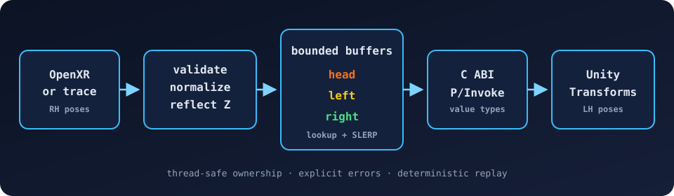

# XRBridge

[](https://github.com/RitwijParmar/XRBridge/actions/workflows/ci.yml)

XRBridge moves timestamped headset and controller poses across a native/managed
boundary. A C++20 library validates OpenXR-style right-handed poses, converts
them to Unity's left-handed convention, buffers each device independently, and
answers timestamp queries with linear position interpolation and quaternion
SLERP. A Unity Package Manager package consumes the stable C ABI through
explicitly laid-out C# P/Invoke types.



[Watch the narrated native replay walkthrough](https://github.com/RitwijParmar/XRBridge/releases/download/v1.0.0/XRBridge-native-demo-v1.0.0.mp4)
(2:36, 1080p). It explains the coordinate contract, buffer and ABI boundaries,
test matrix, and measured benchmark. The video uses the real native build and
committed synthetic benchmark; it is not presented as Unity or headset footage.

## Coordinate contract

OpenXR uses +Y up, +X right, and -Z forward. Unity uses +Y up, +X right, and +Z
forward. XRBridge applies the reflection `S = diag(1, 1, -1)`:

- position: `(x, y, z) -> (x, y, -z)`
- rotation matrix: `R_unity = S * R_openxr * S`
- quaternion in `(x, y, z, w)` storage: `(-x, -y, z, w)`, then normalized

The same reflection is its inverse. Tests compare rotated basis vectors and
exercise quaternion/matrix and OpenXR/Unity round trips.

## Build and test

Requirements are CMake 3.24+, a C++20 compiler, and internet access for the
pinned GoogleTest source archive.

```sh
cmake -S . -B build -DCMAKE_BUILD_TYPE=Release
cmake --build build --parallel
ctest --test-dir build --output-on-failure
./build/xrbridge_benchmark --samples 200000 --output benchmark.json
```

Sanitizer build on Clang or GCC:

```sh
cmake -S . -B build-asan -DCMAKE_BUILD_TYPE=Debug \
  -DXRBRIDGE_ENABLE_SANITIZERS=ON -DXRBRIDGE_BUILD_BENCHMARK=OFF
cmake --build build-asan --parallel
ctest --test-dir build-asan --output-on-failure
```

The test suite covers known-axis rotations, handedness conversion,
normalization, matrix round trips, SLERP, transform composition, interpolation,
validation and overflow, concurrency, C ABI lifecycle/errors, and a deterministic
100,000-pose replay. Linux CI runs AddressSanitizer and UndefinedBehaviorSanitizer.

## Native and managed boundary

`include/xrbridge/xrbridge.h` is the supported ABI: fixed-layout value structs,
integer result codes, caller-owned outputs, and no C++ allocation crossing the
boundary. Initialization and shutdown are serialized. Each API call acquires a
shared context before work begins, so shutdown cannot invalidate an in-flight
call. Pose queues and statistics share one mutex and are safe for concurrent
producers and consumers. `xrbridge_last_error()` is thread-local and remains
valid until the next API call on that thread.

The optional `XRBRIDGE_WITH_OPENXR` build flag enables the adapter in
`openxr_adapter.hpp` and requires an installed package exporting the official
`OpenXR::headers` CMake target. It converts `XrPosef` into the core type; the
default synthetic path has no loader or headset dependency.

## Unity installation

1. Build the native shared library for the Unity editor/player platform.
2. Copy `xrbridge.dll`, `libxrbridge.dylib`, or `libxrbridge.so` into a
   `Runtime/Plugins/<platform>` directory in the host project or installed package.
3. In Package Manager, choose **Add package from disk** and select
   `unity/com.ritwij.xrbridge/package.json`.
4. Import **XRBridge Demo** from the package Samples tab and open
   `XRBridgeDemo.unity`.

The demo replays a checked-in synthetic trace and creates a headset, two
controllers, colored trails, connection state, sample age, and dropped-sample
count. EditMode tests cover managed coordinate helpers and wrapper error/lifecycle
behavior; the PlayMode test checks the monotonic clock. Unity was not installed
on the benchmark host, so the scene and Unity Test Framework assemblies were not
executed there. The non-Unity managed binding subset was compiled and formatted
with .NET 8 and is checked the same way in CI.

## Measured benchmark

The committed raw result is
[`benchmarks/recordings/apple-m3-release-2026-08-24.json`](benchmarks/recordings/apple-m3-release-2026-08-24.json).
It is one deterministic, single-process run; it is not a headset or end-to-end
frame-latency measurement.

| Field | Measured value |
|---|---:|
| Synthetic samples | 200,000 |
| Interpolated queries | 199,999 |
| Combined throughput | 9,816,096 ops/s |
| Median query latency | 83 ns |
| p95 query latency | 84 ns |
| Dropped samples / interpolation failures | 0 / 0 |
| Max position / angular round-trip error | 0 m / 0 rad |

Environment: 8-core Apple M3 MacBook Air, 16 GB RAM, Darwin 25.2.0 arm64,
Apple Clang 17.0.0, Release. The JSON records the exact command and unrounded
values. See [benchmark methodology](docs/benchmark-methodology.md).

## Known limitations

- No physical XR hardware or OpenXR runtime was available for this build.
- The buffer holds discrete position/orientation only; velocities, prediction,
  tracking confidence, and clock-domain synchronization are outside its contract.
- A process has one native context. Managed clients share its lifecycle, but
  callers must agree on the first client's capacity and staleness configuration.
- The queue favors clear invariants over a lock-free design; benchmark results
  should not be generalized across hardware or producer contention levels.

MIT licensed. See [architecture notes](docs/architecture.md) for invariants and
failure behavior.
